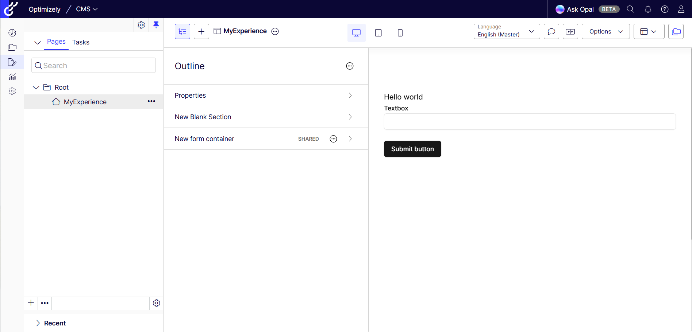

# Visual Builder Forms example

> [!NOTE]  
> Please follow https://github.com/episerver/cms-saas-vercel-demo for general information about how to configure your CMS SaaS instance.

## How to use Visual Builder in CMS (SaaS)

This repository contains a Hello World example of the Optimizely Visual Builder Forms.
Ensure you have a running an Optimizely CMS (SaaS) instance. For more information on CMS (SaaS) see the [developer documentation](https://docs.developers.optimizely.com/content-management-system/v1.0.0-CMS-SaaS/docs/overview-of-cms-saas) or [end-user documentation](https://support.optimizely.com/hc/en-us/categories/27676671778061).

If you have an empty CMS instance, and you want to see how it all
works go to your CMS (SaaS) instance and:

* **Activate Forms (Form Settings)**

1. Go to **Settings** > **Forms Settings**.
2. Click **Activate** button.

* **Create Sample Content Type (Custom Block Type)**

1. Go to **Settings** > **Content Types**.
2. Click **Create New** and select **Block Type** from the drop-down list.
3. Enter _ParagraphElement_ for the **Name** and **Display name** fields.
4. Click **Create**. 
5. Click **Add Property** and select **Text** from the drop-down list.
6. Enter _Text_ for the **Name** in the **Configure Property** page.
7. Click on the **Text Type** drop-down menu and select **XHTML string (>255)**.
8. Click **Save**.
9. Go to **Setting** 
10. Tick checkboxes **Available for composition in Visual Builder** and **Display as Element**
11. Click **Save**.

Then in order to run the sample you need to do the following:

1. Clone this repository.
2. Create a new file, named `.env.local`. 
3. From the Optimizely CMS (SaaS) dashboard, copy the `Single key` from the **Render Content** section.
4. In the `.env.local` file, enter "GRAPH_SINGLE_KEY=" and paste your `Single key` from step 3.
5. In the `.env.local` file, enter "CMS_URL=" and paste your `CMS` url, for example `app-mysuperapp.cms.optimizely.com`
6. Run `yarn install`.
7. Run `yarn codegen` to generate graphql queries.
8. Run `yarn dev` to start the site. It will run on `https://localhost`

If you would like to see the site preview in Edit Mode of your SaaS instance
you will need to configure it in the `Applications` section of `Settings`.


Add a new application website pointing to your local nextjs application running on `https://localhost:3000`.
It should look like this:


> [!NOTE]  
> More info on `Applications` can be found here https://docs.developers.optimizely.com/content-management-system/v1.0.0-CMS-SaaS/docs/create-a-demo-site-using-cms-saas-and-netlify#cms-saas-ui-configuration

Now go to `Edit Mode` and create a new shared block of `Form Container` type.


Add form step, row, column and some form elements


Now go to `Edit Mode` and create a new experience of `Blank Experience` type.


Type in the name and hit `Create Experience`.


Drag the form container to the experience.


Please add a new section, row, column and an element of `Paragraph Type`.

Fill in the text `Hello world!` and you should see it in the preview.


Click on `Outline` to go back to experience preview.



## A detailed process of creating this sample Hello World app

All parts of this repository are described step by step so if you prefer to build stuff yourself
then please find the instructions below. 

### Prerequisites

We are going to create a simple Next.js app which will consume data from our SaaS instance

Let's create a new Next.js application based on the `hello world` example template
> npx create-next-app@latest vb-test --use-yarn --example hello-world vb-test

Let's add graphql support by installing the following dependencies:
> yarn add @apollo/client graphql

Now we need to install development tools which will generate objects based on your graphql schema.
> yarn add --dev @graphql-codegen/cli @graphql-codegen/client-preset @parcel/watcher

Now let's add a configuration file for the codegen plugin. Please create a new file in the root folder `codegen.ts` 
and paste the following code:

```ts
import { CodegenConfig } from "@graphql-codegen/cli";
import { loadEnvConfig } from "@next/env";

loadEnvConfig(process.cwd());

const graphUrl = process.env.GRAPH_URL
const graphSingleKey = process.env.GRAPH_SINGLE_KEY

const config : CodegenConfig = {
    schema: `https://${graphUrl}/content/v2?auth=${graphSingleKey}`,
    documents: ["src/**/*.{ts,tsx}"],
    ignoreNoDocuments: true,
    generates: {
        './src/graphql/': {
            preset: 'client',
            plugins: [],
        }
    }
}

export default config
```

We now need to add a new script to package.json

> "codegen": "graphql-codegen"

This script will generate types based your graphql schema.

### Activate forms

Before we run the codegen let's activate forms in our SaaS CMS instance. 
Please open `Settings` and `Forms Settings` screen.


Click on `Activate` button to activate forms.


### Adding first element component

Let's create a new React component which will display our `ParagraphElement`.

The code will be something like this:

```tsx
import { FragmentType, useFragment } from '../../graphql/fragment-masking'
import { graphql } from '@/graphql'

export const ParagraphElementFragment = graphql(/* GraphQL */ `
    fragment paragraphElement on ParagraphElement {
        Text {
            html
        }
    }
`)

const ParagraphElementComponent = (props: {
    paragraphElement: FragmentType<typeof ParagraphElementFragment>
}) => {
    const paragraphElement = useFragment(ParagraphElementFragment, props.paragraphElement)
    // @ts-ignore
    return <div dangerouslySetInnerHTML={{ __html: paragraphElement.Text?.html }}></div>
}

export default ParagraphElementComponent
```

### Adding form elements componenet

Let's create a new React component which will display our `TextboxElementComponent`. This element can be render in normal section when composition is Element.

The code will be something like this:

```tsx
import { FragmentType, useFragment } from '../../graphql/fragment-masking'
import { graphql } from '@/graphql'
import { Input } from '../ui/input'
import { Label } from '../ui/label'
import { isRequiredValidator } from '@/helpers/validatorHelper'

export const TextboxComponentNodeFragment = graphql(/* GraphQL */ `
fragment textboxElement on OptiFormsTextboxElement {
  Label
  Tooltip
  Placeholder
  AutoComplete
  PredefinedValue
  Validators
}
`)

const TextboxElementComponent = (props: {
    textboxElement: FragmentType<typeof TextboxComponentNodeFragment>,
    formState?: any
}) => {
    const node = useFragment(TextboxComponentNodeFragment, props.textboxElement)
    
    return (
        <div>
            <Label>{node.Label} <span className='form-element-required'>{isRequiredValidator(node.Validators) ? "*" : ""}</span></Label>
            <Input
                type='text'
                autoComplete={node.AutoComplete ? 'on' : 'off'}
                placeholder={node.Placeholder ?? ''}
                onChange={(e) => props.formState[node.Label!] = e.target.value }
            />
        </div>
    )
}

export default TextboxElementComponent
```

### Adding some forms element components

Let's create a new React component which will display our `TextboxElementComponent`.

The code will be something like this:

```tsx
import { FragmentType, useFragment } from '../../graphql/fragment-masking'
import { graphql } from '@/graphql'
import { Input } from '../ui/input'
import { Label } from '../ui/label'
import { isRequiredValidator } from '@/helpers/validatorHelper'

export const TextboxComponentNodeFragment = graphql(/* GraphQL */ `
fragment textboxElement on OptiFormsTextboxElement {
  Label
  Tooltip
  Placeholder
  AutoComplete
  PredefinedValue
  Validators
}
`)

const TextboxElementComponent = (props: {
    textboxElement: FragmentType<typeof TextboxComponentNodeFragment>,
    formState?: any
}) => {
    const node = useFragment(TextboxComponentNodeFragment, props.textboxElement)
    
    return (
        <div>
            <Label>{node.Label} <span className='form-element-required'>{isRequiredValidator(node.Validators) ? "*" : ""}</span></Label>
            <Input
                type='text'
                autoComplete={node.AutoComplete ? 'on' : 'off'}
                placeholder={node.Placeholder ?? ''}
                onChange={(e) => props.formState[node.Label!] = e.target.value }
            />
        </div>
    )
}

export default TextboxElementComponent
```

Let's create a new React component which will display our `SubmitElementComponent`.

The code will be something like this:

```tsx
import { FragmentType, useFragment } from '../../graphql/fragment-masking'
import { graphql } from '@/graphql'
import { Input } from '../ui/input'
import { Button } from '../ui/button'
import axios from 'axios'

export const SubmitElementComponentNodeFragment = graphql(/* GraphQL */ `
fragment submitElement on OptiFormsSubmitElement {
  Label
  Tooltip
}
`)

const SubmitElementComponent = (props: {
    submitElement: FragmentType<typeof SubmitElementComponentNodeFragment>,
    formState?: any
}) => {
    const node = useFragment(SubmitElementComponentNodeFragment, props.submitElement)

    return (
        <>
            <div><br /></div>
            <Button onClick={(e) => {
                console.log(props.formState)
                axios.post((window as any).submitUrl, props.formState)
                .then(response => {
                    alert('Form submitted successfully!');
                })
                .catch(error => {
                    console.error('Error submitting form:', error);
                });
            }}>
                {node.Label}
            </Button>
        </>
    )
}

export default SubmitElementComponent
```

### Adding the layout component

Now we need the master component which will be responsible for rendering the layout (sections/row/columns):

```tsx
import React, { FC, useEffect, useState } from 'react'
import { useQuery } from '@apollo/client'

import { graphql } from '@/graphql'
import CompositionNodeComponent from './CompositionNodeComponent'
import { onContentSaved } from "@/helpers/onContentSaved";
import FormsComponent from './FormsComponent';

export const VisualBuilder = graphql(/* GraphQL */ `
query VisualBuilder($key: String, $version: String) {
  _Experience(where: {
      _metadata: { key: { eq: $key } }
      _or: { _metadata: { version: { eq: $version } } }
    }) {
    items {      
      composition {
        grids: nodes {
          ... on CompositionStructureNode {
            key
            __typename
            displayName
            nodeType
            layoutType
            component {
              	..._IComponent
            }
            nodes: nodes {
              ... on CompositionStructureNode {
                key
                __typename
                displayName
                nodeType
                layoutType
                nodes: nodes {
                  ... on CompositionStructureNode {
                    key
                    __typename
                    displayName
                    nodeType
                    layoutType
                    nodes: nodes {
                      ...compositionComponentNode
                      ... on CompositionStructureNode {
                        key
                        __typename
                        displayName
                        nodeType
                        layoutType
                        nodes: nodes {
                          ...compositionComponentNode
                        }
                      }
                    }
                  }
                }
              }
            }
          }
        }
      }
      _metadata {
        key
        version,        
      }
    }
  }
}

fragment _IComponent on _IComponent {
  __typename
  ...FormContainerData
}

fragment FormContainerData on OptiFormsContainerData {
    SubmitConfirmationMessage
    ResetConfirmationMessage
    SubmitUrl {
        type
        default
        hierarchical
        internal
        graph
        base
    }
    Title
    Description
    ShowSummaryMessageAfterSubmission
}
`)

interface VisualBuilderProps {
    contentKey?: string;
    version?: string;
}

const VisualBuilderComponent: FC<VisualBuilderProps> = ({ version, contentKey }) => {
    const formState: any = {};
    const variables: Record<string, unknown> = {};
    if (version) {
        variables.version = version;
    }

    if (contentKey) {
        variables.key = contentKey;
    }

    const { data, refetch } = useQuery(VisualBuilder, {
        variables: variables,
        notifyOnNetworkStatusChange: true,
    });

    useEffect(() => {
        onContentSaved(_ => {
            const contentIdArray = _.contentLink.split('_')
            if (contentIdArray.length > 1) {
                version = contentIdArray[contentIdArray.length - 1]
                variables.version = version;
            }
            refetch(variables);
        })
    }, []);

    const experiences = data?._Experience?.items;
    if (!experiences) {
        return null;
    }

    if (data?._Experience?.items?.length === 0) {
        return <FormsComponent version={version} contentKey={contentKey} />;
    }

    const experience: any = experiences[experiences.length - 1];

    if (!experience) {
        return null;
    }

    return (
        <div className="relative w-lg flex-1 vb:outline">
            <div className="relative w-lg flex-1 vb:outline">
                {experience?.composition?.grids?.map((grid: any) =>
                    <div key={grid.key} className="relative w-lg flex flex-col flex-nowrap justify-start vb:grid"
                        data-epi-block-id={grid.key}>
                        {RenderCompositionNode(grid, formState)}
                    </div>
                )}
            </div>
        </div>
    )
}

export default VisualBuilderComponent

export const RenderCompositionNode = (node: any, formState?: any): JSX.Element | null => {
    if (!node || !node.__typename) {
        return null;
    }
    const { layoutType } = node;
    if (layoutType === "form") {
        const w = window as any;
        w.submitUrl = node.component.SubmitUrl.default;
    }

    // Handle CompositionStructureNode with different nodeTypes
    if (node.__typename === "CompositionStructureNode") {
        const { key, nodeType, nodes } = node;

        // Switch based on nodeType
        switch (nodeType) {
            case "section":
                return (
                    <div key={key} className="flex flex-col vb:section" data-epi-block-id={key}>
                        {nodes?.map((childNode: any) => RenderCompositionNode(childNode, formState))}
                    </div>
                );

            case "step":
                return (
                    <div key={key} className="flex flex-col vb:step" data-epi-block-id={key}>
                        {nodes?.map((childNode: any) => RenderCompositionNode(childNode, formState))}
                    </div>
                );

            case "row":
                return (
                    <div key={key} className="flex flex-row flex-wrap justify-start vb:row gap-4" data-epi-block-id={key}>
                        {nodes?.map((childNode: any) => RenderCompositionNode(childNode, formState))}
                    </div>
                );

            case "column":
                return (
                    <div key={key} className="flex-1 flex flex-col flex-nowrap justify-start vb:col" data-epi-block-id={key}>
                        {nodes?.map((childNode: any) => RenderCompositionNode(childNode, formState))}
                    </div>
                );

            default:
                // Handle any other nodeType or fallback to generic structure
                return (
                    <div key={key} className="flex flex-col vb:generic" data-epi-block-id={key}>
                        {nodes?.map((childNode: any) => RenderCompositionNode(childNode, formState))}
                    </div>
                );
        }
    }

    // Handle CompositionComponentNode (leaf elements)
    if (node.__typename === "CompositionComponentNode" || node.component) {
        return (
            <div key={node.key} data-epi-block-id={node.key}>
                <CompositionNodeComponent compositionComponentNode={node} formState={formState}/>
            </div>
        );
    }

    // Fallback for unknown node types
    return null;
};
```

It's basically a nested loop on a few levels. We support render both forms and section. For section first iterate over sections, then rows, then columns and finally elements. For forms we iterate over steps, then rows, then columns and finally form elements. We are wrapping each of those layout items into basic tailwind grid classes.

In this simple example there is just one element type but we don't want to hardcode anything so here is a pattern 
that you can use to use a different element component per `nodeType`:

```tsx
import { FragmentType, useFragment } from '../../graphql/fragment-masking'
import { graphql } from '@/graphql'
import TextboxElementComponent from '../elements/TextboxElementComponent'
import SubmitElementComponent from '../elements/SubmitElementComponent'
import ParagraphElementComponent from '../elements/ParagraphElementComponent'

export const CompositionComponentNodeFragment = graphql(/* GraphQL */ `
fragment compositionComponentNode on CompositionComponentNode {
    key
    component {
        _metadata {
            types
        }
      	...textboxElement
        ...submitElement
        ...paragraphElement
    }
}
`)

const CompositionComponentNodeComponent = (props: {
    compositionComponentNode: FragmentType<typeof CompositionComponentNodeFragment>,
    formState?: any
}) => {
    const compositionComponentNode = useFragment(CompositionComponentNodeFragment, props.compositionComponentNode)
    const component = compositionComponentNode.component

    switch (component?.__typename) {
        case "OptiFormsTextboxElement":
            return <TextboxElementComponent textboxElement={component} formState={props.formState}/>
        case "OptiFormsSubmitElement":
            return <SubmitElementComponent submitElement={component} formState={props.formState}/>
        case "ParagraphElement":
            return <ParagraphElementComponent paragraphElement={component} />
        default:
            console.log(`Unknown component type: ${component?.__typename}`);
            return <>NotImplementedException</>
    }
}

export default CompositionComponentNodeComponent
```

As you can see based on `component.__typename` we can use different components - in our
example we will use `OptiFormsTextboxElement` and `OptiFormsSubmitElement`.

### Graphql generation

Now let's go back to our Next.js application and let's try to run the codegen script.
First you will need to fill in your GRAPH_SINGLE_KEY and GRAPH_URL into `.env.local` file (create it if it does not exist). CMS_URL is also required to communicate with Visual Builder.


> yarn codegen

You should see that it successfully generated the schema to `src/graphql` folder:


After that `src/graphql` should contain a few files which will let you write graphql queries.

> **Note:** Every time you change the query inside the `graphql()` function, you need to run `yarn codegen` again.

### Subscribing to content changes

You need to subscribe to a special event in order to know once content has been updated.

In this repo the subscription is already done in [onContentSaved.ts](src%2Fhelpers%2FonContentSaved.ts)

```ts
window.addEventListener("optimizely:cms:contentSaved", (event: any) => {
	const message = event.detail as ContentSavedEventArgs;
});
```

where is defined as following:

```ts
interface ContentSavedEventArgs {
    contentLink: string;
    previewUrl: string;
    isIndexed: boolean;
    properties: PropertySaved[];
    parentId?: string;
    sectionId?: string;
}
```

More details here:
https://docs.developers.optimizely.com/content-management-system/v1.0.0-CMS-SaaS/docs/enable-live-preview#refresh-the-applications-view-when-content-has-changed